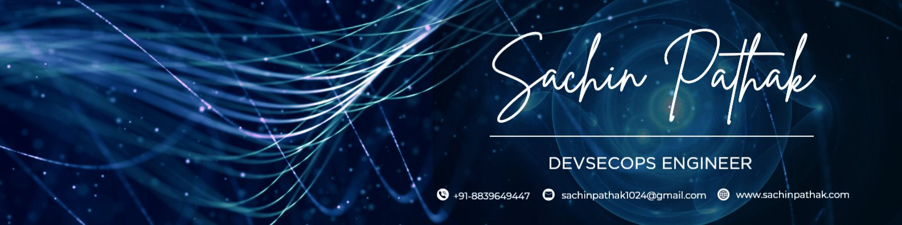

<!-- ===================== BANNER ===================== -->
<p align="center">
  
</p>

<!-- ===================== TITLE ===================== -->
<h1 align="center">
  Hi, I'm Sachin Pathak
  
</h1>

<p align="center">
  <a href="https://git.io/typing-svg">
    
  </a>
</p>

<p align="center">
  <a href="https://sachinpathak.com"></a>
  <a href="https://www.linkedin.com/in/sachinpathak1024/"></a>
  <a href="https://x.com/sach550p"></a>
  <a href="mailto:sachin.pathak1024@gmail.com"></a>
</p>

<p align="center">
  
  
</p>

---

<!-- ===================== WHOAMI ===================== -->
### `~$ whoami`

```yaml
name:       Sachin Pathak
role:       DevSecOps Engineer @ C9Lab (Pinak Infosec Pvt. Ltd.)
location:   Indore, India  (UTC +05:30)
focus:      [ CI/CD, GitOps, Kubernetes, Infrastructure as Code, Cloud Security ]
clouds:     [ AWS, Azure ]
philosophy: "If it hurts, automate it. If it's exposed, secure it."
status:     making deploys boring, the good kind of boring
fuel:       chai + clean YAML
```

> 🔭 I build secure, self-healing pipelines and turn cloud chaos into infrastructure that ships itself.
> 🛡️ Security isn't a final gate for me, it lives inside the pipeline.
> ✍️ I write about DevOps and security on my [**blog**](https://sachinpathak.com/blog.html).

---

<!-- ===================== TECH STACK ===================== -->
### 🧰 Tech Stack

**☁️ Cloud & Platforms**


**📦 Containers & Orchestration**


**⚙️ CI/CD & GitOps**


**🏗️ Infrastructure as Code & Config**


**📈 Observability**


**🔐 Security & Secrets**


**💻 Languages**


---

<!-- ===================== FEATURED WORK ===================== -->
### 🚀 Featured Work

| Project | What it is | Stack |
| :--- | :--- | :--- |
| [**Retail Microservices**](https://sachinpathak.com/details-retail.html) | Containerized retail platform with GitOps delivery | K8s · ArgoCD · Helm |
| [**ITUS Bank Platform**](https://sachinpathak.com/details-itusbank.html) | Secure banking infra with hardened CI/CD | AWS · Terraform · DevSecOps |
| [**Hospital Management**](https://sachinpathak.com/details-hospital.html) | High-availability healthcare deployment | Docker · K8s · Monitoring |
| [**AI Bank**](https://sachinpathak.com/details-aibank.html) | AI-assisted banking workflows on the cloud | Azure · Python · CI/CD |
| [**SkillPulse**](https://sachinpathak.com/details-skillpulse.html) | Learning platform, automated end to end | GitHub Actions · IaC |
| [**LMS Platform**](https://sachinpathak.com/details-lms.html) | Scalable learning management system | Kubernetes · Observability |

<p align="center"><a href="https://sachinpathak.com/#protfolio"><b>See all projects on my portfolio →</b></a></p>

---

<!-- ===================== STATS ===================== -->
### 📊 The Numbers

<p align="center">
  
  
</p>
<p align="center">
  
</p>

---

<!-- ===================== SNAKE ===================== -->
### 🐍 Watch the snake eat my commits

<p align="center">
  
</p>

---

<!-- ===================== OUTRO ===================== -->
<p align="center">
  
</p>

<h3 align="center"><i>"kubectl apply -f good-vibes.yaml"</i></h3>
<p align="center">Got a pipeline that flakes or infra that won't behave? <a href="https://sachinpathak.com/#contact"><b>Let's talk.</b></a></p>
